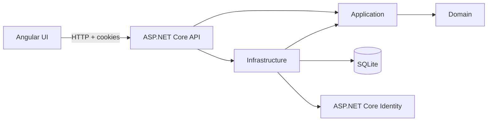

# Expense Tracker

Expense Tracker is a small full-stack budgeting application built with ASP.NET Core, Angular, and SQLite. A user can sign in, create budgets, record income and expenses, see the resulting balance, and delete data they no longer need.

I treated the exercise as more than a CRUD demo. The main goal was to keep the business rules explicit, protect user-owned data, and build the application in small test-driven slices that were easy to reason about and verify.

## What the application does

The complete backend supports registration, cookie-based authentication, and budget and transaction CRUD. The Angular UI focuses on the reviewer workflow:

- Log in with the seeded reviewer account.
- List, create, open, and delete budgets.
- View a budget's calculated balance.
- List transactions grouped by date.
- Add income and expense transactions.
- Delete transactions.
- Log out and return to the protected login flow.

Income and expense are presentation concepts in the UI. The API uses signed amounts: positive values are income and negative values are expenses.

## User stories

The project grew from four groups of user needs:

1. **Account access:** a user can register, log in, inspect their current session, and log out without exposing whether an invalid email exists.
2. **Budget management:** an authenticated user can create, list, inspect, update, and delete only their own budgets.
3. **Transaction tracking:** a user can record, inspect, update, and delete signed transactions inside a budget and see them grouped chronologically.
4. **Reliable balances and privacy:** current balance is calculated from the starting balance and transactions, while inaccessible resources are returned as not found.

## How I approached the exercise

I built the project from the inside out rather than starting with controllers or database tables.

1. **Define the domain rules.** I started with `BudgetTransaction`, then `Budget`, writing failing tests for names, signed amounts, decimal precision, starting balances, and state-preserving updates.
2. **Model the aggregate deliberately.** The design initially treated budgets and transactions as independently loaded entities. I revised it so `Budget` owns its transaction collection and creates new transactions, because a transaction has no business meaning outside its budget. Targeted update and delete queries remain a pragmatic exception when the full aggregate is unnecessary.
3. **Add persistence without "leaking it inward".** Database support was added without making the inner business layers depend on EF Core, SQLite mappings, Identity, repositories, or value converters, which live in Infrastructure. Domain money remains `decimal`, while SQLite stores exact integer cents.
4. **Add authentication and use cases.** Registration, cookie login, current-user resolution, logout, ownership checks, and application services came before the remaining HTTP endpoints.
5. **Finish the API in vertical slices.** Budget and transaction operations were added one behavior at a time, followed by consistent error handling and a complete manual walkthrough with two different users to make sure they can only see the data that belongs to them.
6. **Build the Angular UI last.** The browser application consumes the existing HTTP contract, renders backend-provided transaction groups, and keeps transaction type as a frontend-only sign choice.
7. **Verify the real workflow.** Beyond unit tests, I ran the API and UI together against a fresh migrated SQLite database and exercised login, creation, validation, deletion, logout, and protected-route behavior.

The recurring development loop was: write the smallest useful failing test, implement the minimum behavior, run the focused suite, run the full suite, and then refactor while green.

## Key design decisions

| Decision | Reasoning |
|---|---|
| Clean Architecture dependency direction | Keeps Domain and Application independent of ASP.NET Core, Identity, EF Core, and UI concerns. |
| `Budget` as aggregate root | New transactions enter through the budget, which owns the relationship and balance behavior. |
| Signed transaction amounts | Avoids persisting a redundant transaction-type field and makes balance calculation direct. |
| `decimal` in C#, integer cents in SQLite | Preserves a convenient domain model without relying on SQLite floating-point storage. |
| Identity application cookies | Fits a browser application without introducing bearer-token storage or refresh-token machinery. |
| Angular development proxy | Keeps browser API calls same-origin and avoids unnecessary development CORS configuration. |
| XSRF token cookie and header | Protects cookie-authenticated state-changing requests using Angular's built-in convention. |
| Backend date grouping | Gives every client one deterministic transaction ordering and grouping contract. |
| Thin controllers | HTTP concerns stay in the API while orchestration and rules remain in Application and Domain. |

## Architecture



The backend dependency direction is:

```text
Domain <- Application <- Infrastructure / API
```

- **Domain** owns entities, invariants, aggregate behavior, and balance calculation.
- **Application** owns use cases and interfaces for persistence, identity, and current-user access.
- **Infrastructure** implements those interfaces with EF Core, SQLite, and ASP.NET Core Identity.
- **API** is the composition root and translates HTTP requests and application results.
- **Angular** is a separate HTTP client organized into core services and feature components.

## Run the project

### Requirements

- .NET SDK 10. The root `global.json` selects the supported SDK feature band.
- Node.js `^20.19.0`, `^22.12.0`, or `^24.0.0`.
- npm.
- Chrome or Chromium if you want to run the Angular test suite.

The frontend includes an `.nvmrc` for Node 22. If you use nvm:

```bash
cd frontend
nvm use
cd ..
```

### 1. Restore dependencies

From the repository root:

```bash
dotnet restore ExpenseTracker.sln

cd frontend
npm ci
cd ..
```

### 2. Start the API

```bash
ASPNETCORE_URLS=http://127.0.0.1:5000 dotnet run --project src/ExpenseTracker.Api
```

On startup, the API applies pending migrations and idempotently creates the reviewer account. This automatic initialization is convenient for the exercise; it is not intended as a production deployment strategy.

### 3. Start Angular

In a second terminal:

```bash
cd frontend
npm start
```

Open <http://localhost:4200> and log in with:

```text
Email: reviewer@example.com
Password: Reviewer123
```

The credentials are public demonstration data, not a production secret. The Angular development server proxies `/api/**` to `http://127.0.0.1:5000`, so Identity and antiforgery cookies work without bearer tokens or development CORS setup.

## Run the checks

Backend unit tests:

```bash
dotnet test ExpenseTracker.sln --no-restore --nologo
```

Frontend behavior tests and production build:

```bash
cd frontend
npm run test:ci
npm run build
```

The current suites contain 135 .NET unit tests and 10 Angular behavior tests. The Angular tests focus on request contracts, authentication state, error mapping, amount-sign mapping, and navigation rather than markup or styling.

To inspect migration consistency, restore the repository-local EF tool and check the model:

```bash
dotnet tool restore
dotnet tool run dotnet-ef migrations has-pending-model-changes \
  --project src/ExpenseTracker.Infrastructure \
  --startup-project src/ExpenseTracker.Api
```

## Useful API routes

| Area | Routes |
|---|---|
| Health | `GET /health` |
| Authentication | `/api/auth/register`, `/api/auth/login`, `/api/auth/me`, `/api/auth/logout` |
| Budgets | `/api/budgets`, `/api/budgets/{budgetId}` |
| Transactions | `/api/budgets/{budgetId}/transactions`, `/api/budgets/{budgetId}/transactions/{transactionId}` |

All budget and transaction routes require the Identity application cookie. Request bodies never accept a user ID; ownership comes from the authenticated principal.

## Repository layout

```text
src/
  ExpenseTracker.Domain/
  ExpenseTracker.Application/
  ExpenseTracker.Infrastructure/
  ExpenseTracker.Api/

tests/
  ExpenseTracker.Domain.UnitTests/
  ExpenseTracker.Application.UnitTests/
  ExpenseTracker.Infrastructure.UnitTests/
  ExpenseTracker.Api.UnitTests/

frontend/
  src/app/core/
  src/app/features/
```

## Intentional boundaries

- OpenAPI and Swagger were excluded from the exercise, mostly due to time constraints.
- Automated integration and browser end-to-end test projects were deferred; real EF Core, SQLite, cookie, and hosted UI behavior was verified through repeatable manual workflows.
- The Angular UI does not expose registration or update screens, although those operations are supported by the API. Again, due to time constraints.
- There are no roles, categories, recurring transactions, shared budgets, multiple currencies, reporting, or production deployment configuration.
- The seeded reviewer and automatic startup migrations exist only to make evaluation straightforward.

These boundaries kept the implementation focused on the core budgeting workflow, domain modeling, ownership security, persistence correctness, and a usable full-stack demonstration.

# GEN-AI EXERCISE
For this part my preferred tool was Codex. To kick things off, I added an AGENTS.md file detailing Git privacy rules and workflow, some architecture rules, TDD workflow that the agent should follow and what a completion report should look like.

I also added `docs/gen-ai-exercise.md` in which copy-pasted the requirement from the Technical Interview Exercise document. With that setup, my first prompt was:

```
You'll help me develop the feature described in docs/gen-ai-exercise.md. We will do it in one slice.

First, read AGENTS.md. You must follow the TDD workflow detailed in there.

Then, inspect the repository and prepare a detailed implementation plan.

The plan must include:

Scope.
Expected files and code changes.
Tests to write first.
Explicit exclusions.
Completion criteria.
Any assumptions, ambiguities, or decisions that require approval.

Do not make decisions that affect requirements, API contracts, architecture, data modeling, security, or slice scope without presenting them to me first. You may make routine, low-risk implementation choices that follow the existing specification, but identify them clearly in the plan.

Do not implement or modify files yet.
```

This helps me generate an implementation plan that I can check and iterate, and also confirm if any assumptions were made to adjust them. After that, the point is to make this plan a durable artifact that can survive between sessions, so I continue with:

```
You will save the agreed plan as:

docs/plan.md

Do not print the content of the file in the CLI. Your final response should only confirm whether the file was created successfully.

Preserve the agreed plan exactly, except for formatting or corrections explicitly approved by me. Do not begin implementation.
```

I've included the plan as evidence. With the plan saved then comes actual development:

```
Implement only the approved plan in docs/plan.md.

Follow the TDD workflow and all architecture rules in AGENTS.md. Do not implement unrelated improvements.

If implementation reveals a conflict or requires a decision not covered by the approved plan, stop before making that decision and explain the issue.

At completion:

Run the relevant tests.
Run the full unit-test suite.
Review the diff for unrelated changes.
Report changed files, tests, commands, results, manual checks, and unresolved issues.

The task can only be considered completed if all of the CRUD operations work and persist data.
```

With this prompt, any decision becomes a checkpoint, so the agent does not infer as much and allows me to make decisions. In my experience the AGENTS.md file can be ignored. It happens very infrequently, but it can happen, so I prompt the agent to read it again. The final report gives me a good idea of what happened during development and the process the agent followed to ensure correcteness. I saved the completion report in `docs/report.md` for anyone to see.

The final constraint allows the agent to enter in somehwat of a loop; it stops only when the feature actually works. Once it's done, changes are not committed so I can review them myself. If everything's, and after asking for changes if necessary, I simply ask it to commit and push.